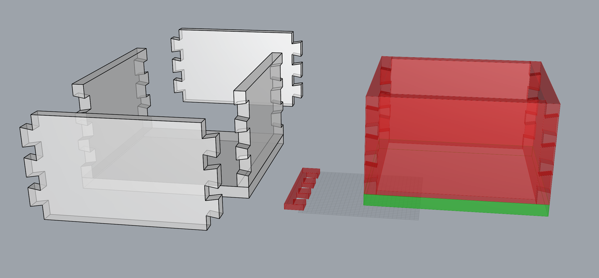

# Grasshopper dovetail box generator
My first attempt at a parametric design in Grasshopper, which is a plugin for [Rhino3d](https://www.rhino3d.com/)

Box dimensions, wall thickness and dovetail angle can be defined by you.

# TODO
- [ ] Generate 3d-printable guides (first one is done)
- [ ] Add spacing between joints, is currently watertight.
